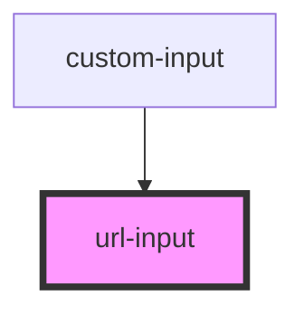

# url-input

<!-- Auto Generated Below -->

## Properties

| Property            | Attribute            | Description | Type                                   | Default         |
| ------------------- | -------------------- | ----------- | -------------------------------------- | --------------- |
| `inputTitle`        | `input-title`        |             | `string`                               | `undefined`     |
| `isValid`           | `is-valid`           |             | `boolean`                              | `undefined`     |
| `size`              | `size`               |             | `InputSize.DEFAULT \| InputSize.LARGE` | `undefined`     |
| `type`              | `type`               |             | `InputType.TEXT \| InputType.URL`      | `InputType.URL` |
| `validationPattern` | `validation-pattern` |             | `string`                               | `'https?://.+'` |

## Events

| Event       | Description | Type                                                |
| ----------- | ----------- | --------------------------------------------------- |
| `userInput` |             | `CustomEvent<{ value: string; isValid: boolean; }>` |

## Dependencies

### Used by

 - [custom-input](../custom-input)

### Graph

----------------------------------------------

*Built with [StencilJS](https://stenciljs.com/)*
